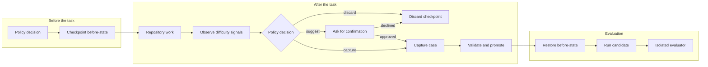

# Capture Bench Cases

Turn difficult, real-world AI coding work into a private, reproducible benchmark—without using the already-solved workspace as the candidate input.

`bench-creator` is an [Agent Skill](https://agentskills.io/) for building and maintaining one global `ai-work-bench/v1` hub across multiple repositories. It checkpoints a repository before an AI changes it, captures the reusable difficulty after the task, validates privacy and reproducibility, and evaluates future candidates in restored, isolated workspaces.

The skill is packaged as a dual-compatible plugin for Codex and Claude Code. Both agents load the same files under `skills/bench-creator`; only their plugin manifests differ.

## Why use it?

Most coding benchmarks are written after the solution is known. That can accidentally leak the fix, the final diff, or the root cause into the candidate's input. This skill preserves the authentic before-state instead.

It helps you:

- collect benchmark cases from genuine engineering work across repositories;
- preserve dirty working trees with private snapshots;
- capture only tasks with useful difficulty signals;
- keep candidate-visible instructions separate from hidden evaluators and oracles;
- validate schemas, fixtures, privacy rules, and capture policy;
- run every case in a temporary workspace without modifying the live checkout; and
- export a sanitized metadata catalog separately from sensitive runnable source.

## How it works



The Bench is global, while repositories remain source projects. By default, the hub lives at `~/.codex/benches/daily-work`; set `AI_WORK_BENCH_HOME` to use another location.

## Requirements

- Codex or another agent that supports the Agent Skills format
- Python 3.10 or later
- PowerShell on Windows, or a POSIX-compatible shell on macOS/Linux
- Git only when using `repo-ref` workspaces; the default `snapshot` mode does not require a clean Git tree

The CLI uses only the Python standard library.

## Installation

### Install the standalone Skill with Codex

Ask Codex to install the Skill from the repository's `skills/bench-creator` directory:

```text
$skill-installer install https://github.com/EvanLuo42/bench-creator/tree/master/skills/bench-creator
```

Restart Codex after installation so it discovers the Skill. The repository also includes `.codex-plugin/plugin.json` for local testing and submission as a skills-only Codex plugin.

### Install as a Claude Code plugin

Add this repository as a Claude Code marketplace, then install the plugin:

```text
/plugin marketplace add EvanLuo42/bench-creator
/plugin install bench-creator@bench-creator
```

Claude exposes the Skill under the plugin namespace as `/bench-creator:bench-creator` and can also invoke it automatically when its description matches the task.

### Install manually

Clone this repository and copy `skills/bench-creator` into your personal Codex skills directory.

macOS/Linux:

```bash
git clone <repository-url>
mkdir -p ~/.codex/skills
cp -R BenchSkill/skills/bench-creator ~/.codex/skills/bench-creator
```

Windows PowerShell:

```powershell
git clone <repository-url>
New-Item -ItemType Directory -Force "$env:USERPROFILE\.codex\skills" | Out-Null
Copy-Item -Recurse ".\BenchSkill\skills\bench-creator" "$env:USERPROFILE\.codex\skills\bench-creator"
```

For local Claude Code development, run `claude --plugin-dir .` from the repository root.

## Quick start

### 1. Initialize your global Bench

Initialization is intentionally explicit. Ask Codex:

```text
Use $bench-creator to initialize my global Daily Work Bench in suggest mode with snapshot workspaces.
```

The equivalent CLI commands are:

macOS/Linux:

```bash
sh ~/.codex/skills/bench-creator/scripts/benchctl.sh init \
  --name "Daily Work Bench" \
  --mode suggest \
  --workspace-mode snapshot
```

Windows PowerShell:

```powershell
powershell -NoProfile -ExecutionPolicy Bypass `
  -File "$env:USERPROFILE\.codex\skills\bench-creator\scripts\benchctl.ps1" `
  init --name "Daily Work Bench" --mode suggest --workspace-mode snapshot
```

`suggest` is the recommended starting mode: the skill checkpoints eligible work and asks before retaining a case. Other modes are `auto` and `off`.

### 2. Use the skill during repository work

You can invoke it explicitly:

```text
Use $bench-creator to checkpoint this repository before making changes. After the task, suggest a benchmark case if we encounter a non-obvious or reusable difficulty.
```

You can also make a direct capture request:

```text
Use $bench-creator to capture this task as a private Bench case and validate it before promotion.
```

Once installed, Codex may invoke the skill automatically for substantive repository work when the global Bench policy enables automatic or suggested capture.

### 3. Review and run ready cases

List and validate the Bench:

```bash
<benchctl> list
<benchctl> validate
```

Run ready cases against a trusted local candidate command:

```bash
<benchctl> run --candidate-json '["python","/absolute/path/to/candidate.py"]'
```

In the examples above, replace `<benchctl>` with the installed launcher:

- macOS/Linux: `sh ~/.codex/skills/bench-creator/scripts/benchctl.sh`
- Windows: `powershell -NoProfile -ExecutionPolicy Bypass -File "$env:USERPROFILE\.codex\skills\bench-creator\scripts\benchctl.ps1"`

## Capture lifecycle

The skill normally drives this lifecycle for you, but the underlying commands are available for inspection and automation.

```bash
# Register the current repository in the global hub.
<benchctl> project register --source . --name "My Project"

# Request an explicit before-task decision and checkpoint.
<benchctl> policy decide --phase before --explicit
<benchctl> checkpoint start --source . --trigger explicit

# After authoring a case JSON draft, attach the immutable checkpoint.
<benchctl> capture --input /path/to/case.json --checkpoint <checkpoint-id>

# Validate and promote a reproducible draft.
<benchctl> validate --id <case-id>
<benchctl> promote --id <case-id>
```

For suggested capture, Codex asks for confirmation and passes `--confirmed`. Automatic and suggested cases must satisfy the configured minimum number of observed difficulty signals, such as a failed approach, hidden requirement, environment constraint, fragile integration, or verification gap.

## Workspace modes

| Mode | Use it when | Important behavior |
| --- | --- | --- |
| `snapshot` | General repository work, including uncommitted changes | Captures tracked modifications and non-ignored untracked files while excluding Git metadata, dependencies, caches, build output, and `.benchignore` matches |
| `repo-ref` | The repository is clean and has a durable local Git mapping | Stores a Git reference instead of a portable snapshot |
| `off` | You want metadata-only workflows | Disables workspace capture |

`snapshot` is the safest default for authentic before-state capture. A failed checkpoint never blocks the parent coding task, and the skill must not reconstruct candidate input from the solved workspace.

## Privacy and safety

New hubs default to private visibility, source export disabled, `suggest` capture mode, and `snapshot` workspaces.

- Credential-like files, detected secrets, oversized inputs, and symbolic links are refused during snapshotting.
- Snapshots, checkpoints, fixtures, hidden oracles, and reports are ignored by the generated Git configuration.
- Secret scanning is a refusal gate, not proof that source is safe to share.
- Metadata catalog export omits workspaces, evaluator commands, root causes, and failed approaches.
- Runnable source export requires an explicit manifest opt-in, command-line acknowledgement, and approved or synthetic cases.
- Candidate and evaluator commands are trusted local programs. Temporary workspace isolation protects the live checkout, but it is not a hostile-code sandbox.

Create a metadata-only export with:

```bash
<benchctl> export --output /path/to/new-catalog-directory
```

Treat any runnable export as sensitive, even after all privacy gates pass.

## CLI overview

| Command | Purpose |
| --- | --- |
| `init` | Initialize the global Bench hub |
| `project` | Register and inspect source repositories |
| `policy` | Inspect policy or decide what to do before/after a task |
| `checkpoint` | Capture or discard immutable before-task state |
| `capture` | Add or revise a case from a JSON draft |
| `validate` | Validate the manifest, cases, fixtures, and copied schemas |
| `list` | List cases by status or project |
| `promote` | Promote a validated draft to `ready` |
| `schema` | Manage authoritative schema copies |
| `export` | Export a sanitized catalog or explicitly approved runnable cases |
| `run` | Evaluate selected cases against a candidate command |

Run `<benchctl> --help` or `<benchctl> <command> --help` for the complete options.

## Repository layout

```text
bench-creator/
├── .codex-plugin/plugin.json              # Codex plugin manifest
├── .claude-plugin/plugin.json             # Claude Code plugin manifest
├── .claude-plugin/marketplace.json        # Claude Code marketplace catalog
└── skills/bench-creator/
    ├── SKILL.md                            # Shared agent workflow
    ├── agents/openai.yaml                  # Codex Skill UI metadata
    ├── scripts/                            # CLI and launchers
    ├── references/                         # Authoring and runner guidance
    ├── assets/schema/                      # JSON Schemas
    └── tests/test_benchctl.py              # CLI and lifecycle tests
```

## Development

Run the test suite from the repository root:

```bash
python -m unittest discover -s skills/bench-creator/tests -v
```

## License

This project is available under the [MIT License](LICENSE).
